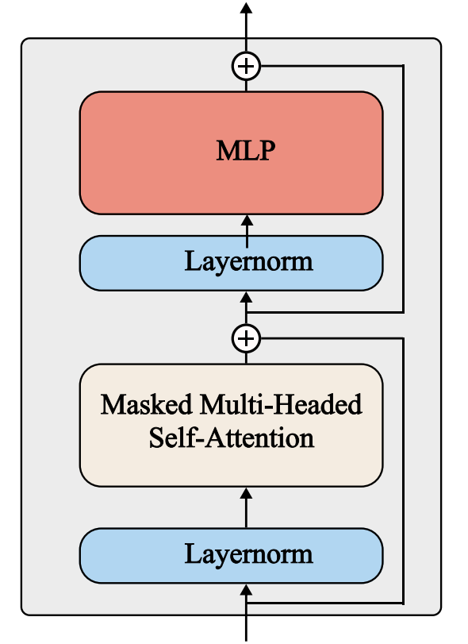

# mini-gpt2

This is an implementation of the final project for the Stanford CS224N class. 

## Getting Started

Run the following command to set up the conda environment and install the required dependencies:

```
source setup.sh
```

This will automatically install all dependencies and activate the environment.

This repository also includes a manual implementation of AdamW.

For the downstream tasks, the model performs sentiment classification on the Stanford Sentiment Treebank (SST) and CFIMDB datasets, cloze-style paraphrase detection on the Quora Question Pairs dataset, and Shakespearean sonnet generation.

## About GPT-2
GPT-2 is a decoder-only transformer model that use a sequence of previous tokens to predict the next token.

### Tokenizatoin
The GPT-2 model uses byte pair encoding (BPE) tokenization. You can play with this [visualization](https://platform.openai.com/tokenizer) by OpenAI, the BPE to
tokenize sentences used in OpenAI’s latest models.

### Embedding Layer
After tokenizing and converting each token to ids, GPT-2 subsequently utilizes a trainable embedding layer across each token. The input embeddings that are used in later portions are the sum of the token embeddings and the position embeddings.

The learnable token embeddings map the individual input ids into vector representation for later use. The positional embeddings are utilized to encode the position of different words within the input. 

### Transformer Layer
<p align="center">
  
</p>

The mini-gpt2 makes use of 12 Decoder Transformer layers. These layers were defined initially in the paper Attention is All You Need. It is composed of masked multi-head attention, Resnets, MLP, and layernorm layers. 

GPT-2 applies dropout after each attention layer as well as after each MLP before the residual connection. GPT-2 also applies dropout to the sums of the embeddings and the positional encodings. It uses a setting of $p_\text{drop} = 0.1$.

### Output
After going through the respective layers the outputs consist of:

1. `last_hidden_state`: the contextualized embedding for each token of the sentence from the last layer

2. `last_token`: the last token embedding

## Acknowledgement

Based on starter code from [Stanford CS224N (Winter 2026) Default Final Project: Build GPT-2](https://github.com/stanfordnlp/cs224n_gpt).

Parts of the code are from the [`transformers`](https://github.com/huggingface/transformers) library ([Apache License 2.0](./LICENSE)).